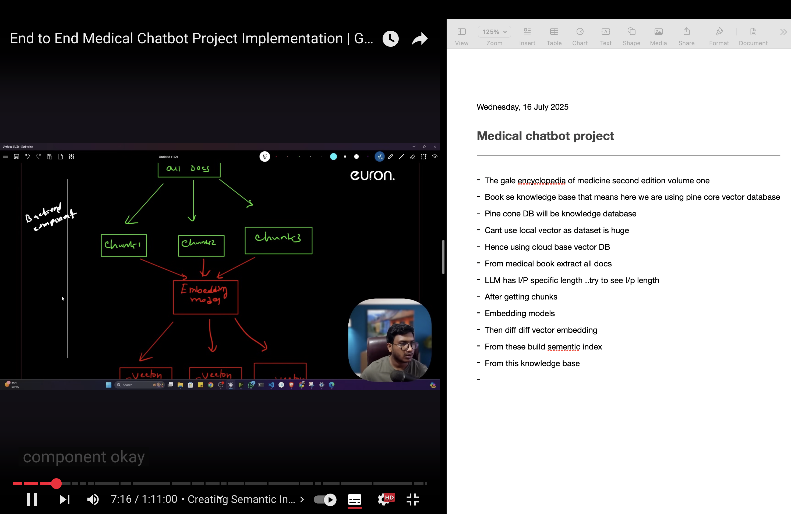

# 🧠 MediBot — AI Medical Information Assistant

> A production-ready Retrieval-Augmented Generation (RAG) chatbot that answers medical queries using semantic search over a 2,000+ page medical encyclopedia — with source citations, rate limiting, and a modern glass-morphism UI.

---

## 🚀 Live Demo

> 🌐 Live Demo: **https://medibot-w7u1.onrender.com**

> Run locally: `http://localhost:8080`



---

## 🏗️ Architecture

```
User Query
    │
    ▼
Flask API (/get)
    │
    ├── Input validation (max 500 chars)
    ├── Rate limiting (20 req/min per IP)
    │
    ▼
HuggingFace Embeddings
(sentence-transformers/all-MiniLM-L6-v2 → 384-dim)
    │
    ▼
Pinecone Vector DB (semantic similarity search, k=3)
    │  Returns top-3 relevant chunks + metadata (source, page)
    ▼
LangChain RAG Chain
    │  Stuffs retrieved context into prompt
    ▼
GitHub Models API → GPT-4o mini
    │  Generates grounded answer with medical disclaimer
    ▼
JSON Response { answer, sources: ["Medical_book.pdf, p.42", ...] }
    │
    ▼
Frontend (glass-morphism UI, source citation tags)
```

---

## 🛠️ Tech Stack

| Layer | Technology |
|-------|-----------|
| LLM | GPT-4o mini via GitHub Models API |
| Embeddings | `sentence-transformers/all-MiniLM-L6-v2` (384-dim) |
| Vector DB | Pinecone (serverless, AWS us-east-1) |
| RAG Framework | LangChain |
| Backend | Flask + Gunicorn |
| Rate Limiting | Flask-Limiter |
| Frontend | Vanilla JS + CSS (glass-morphism, DM Sans) |
| Containerisation | Docker + docker-compose |

---

## ✨ Key Features

- **Source citations** — every answer shows `📄 Medical_book.pdf, p.42` so users know exactly where the information came from
- **Medical disclaimer** — hardcoded in both the system prompt and UI — cannot be bypassed
- **Rate limiting** — 20 requests/min per IP, 200/day — prevents abuse
- **Input validation** — empty messages and inputs over 500 chars are rejected with proper HTTP 400
- **Health check endpoint** — `GET /health` for uptime monitoring and Docker healthchecks
- **Structured logging** — timestamped logs for every request and error
- **Production server** — Gunicorn with 2 workers, not Flask dev server
- **Containerised** — single `docker-compose up` to run

---

## ⚙️ Setup

### Local (conda)

```bash
git clone https://github.com/Deep841/medical-ai-chatbot.git
cd medical-ai-chatbot

conda create -n medibot python=3.10 -y
conda activate medibot

pip install -r requirements.txt

cp .env.example .env
# Fill in PINECONE_API_KEY and GITHUB_NEW_API_TOKEN

python app.py
```

Visit: `http://localhost:8080`

### Docker (production)

```bash
cp .env.example .env
# Fill in your keys

docker-compose up --build
```

### Tests

```bash
pytest
```

The repository includes GitHub Actions CI at `.github/workflows/ci.yml` to run backend tests and frontend lint/build on every push and pull request to `main`.

### Re-index knowledge base (one-time)

```bash
# Place PDFs in the Data/ folder, then:
python store_index.py
```

---

## 🔑 Environment Variables

| Variable | Required | Description |
|----------|----------|-------------|
| `PINECONE_API_KEY` | ✅ | Pinecone API key — [app.pinecone.io](https://app.pinecone.io) |
| `GITHUB_NEW_API_TOKEN` | ✅ | GitHub Models API token — [github.com/marketplace/models](https://github.com/marketplace/models) |
| `HUGGINGFACEHUB_API_TOKEN` | Optional | Only needed to re-run `store_index.py` |

> ⚠️ Never commit `.env` to Git. Use `.env.example` as the template.

---

## 📡 API Reference

| Method | Endpoint | Description |
|--------|----------|-------------|
| `GET` | `/` | Chat UI |
| `GET` | `/health` | Health check — returns `{"status": "ok"}` |
| `POST` | `/get` | Send message, get answer + sources |

**POST /get**
```
Content-Type: application/x-www-form-urlencoded
Body: msg=What is acromegaly?

Response:
{
  "answer": "Acromegaly is a hormonal disorder...",
  "sources": ["Data/Medical_book.pdf, p.42"]
}
```

---

## 📁 Project Structure

```
medical-ai-chatbot/
├── app.py                  # Flask app — routes, RAG chain, rate limiting
├── src/
│   ├── helper.py           # PDF loader, text splitter, embeddings
│   └── prompt.py           # System prompt with medical disclaimer
├── template/chat.html      # Frontend UI
├── static/style.css        # Glass-morphism styles
├── store_index.py          # One-time Pinecone index creation
├── requirements.txt        # Pinned dependencies
├── Dockerfile              # Production container
├── docker-compose.yml      # One-command deployment
└── .env.example            # Environment variable template
```

---

## 🔒 Security

- `.env` is in `.gitignore` — keys never committed
- Non-root Docker user (`appuser`)
- Input length capped at 500 characters
- Rate limiting per IP address
- No `debug=True` in production

---

## 🧠 How RAG Works (for interviews)

1. At startup, the 2,000+ page medical encyclopedia is chunked into 500-character segments and embedded into 384-dimensional vectors stored in Pinecone
2. When a user asks a question, the query is embedded using the same model
3. Pinecone finds the 3 most semantically similar chunks (cosine similarity)
4. Those chunks + the original question are passed to GPT-4o mini
5. The LLM generates a grounded answer — it can only use the retrieved context, not hallucinate
6. The source file and page number are extracted from chunk metadata and returned alongside the answer

---

## 📌 Future Enhancements

- [ ] Swap knowledge base for WHO / Indian govt health guidelines (freely distributable)
- [ ] Add conversation memory (multi-turn chat)
- [ ] Deploy to AWS ECS / Render / Railway
- [ ] Streamlit alternative UI
- [ ] Multilingual query support

---

*Built by [Deep](https://github.com/Deep841) · July 2025*
